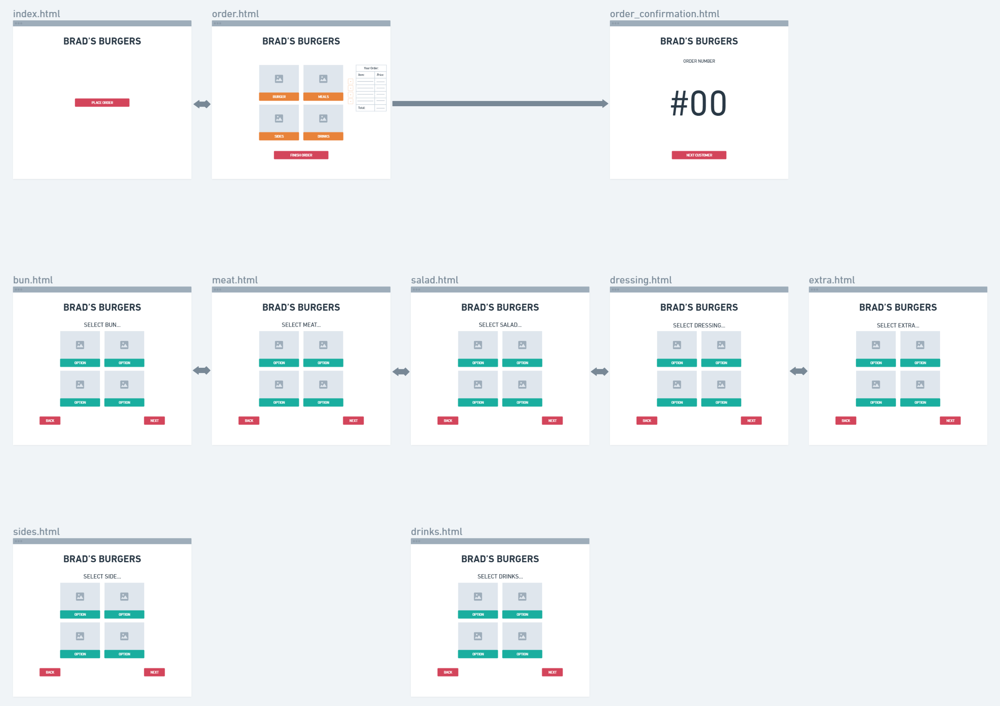

# ***Brad's Burgers***

## Description

For my project, I have created an ordering system for a burger restaurant called ***Brad's Burgers***.

The idea of the ordering system is that when the customer arrives to the restaurant, they will make their order on a terminal.

The customer will first see the home screen which will prompt them to ***Place Order***.

After ***Place Order*** has been selected, the screen will show a list of categories to choose from, ***Burger***, ***Meal***, ***Sides*** and ***Drinks***.

After selecting a category, the customer will have a choice of selecting from a list of the chosen category.

If ***Meal*** was chosen, the customer will get to choose from the three ***Burger***, ***Sides*** and ***Drinks*** categories.

In the ***Burger*** category, the customer will get to make their own burger by selecting from a number of sub-categories, ***Bun***, ***Meat***, ***Salad***, ***Dressing*** and ***Extra***.

The customer may choose one option from the ***Bun*** and ***Meat*** category, but may choose more than one from ***Salad***, ***Dressing*** and ***Extra*** categories at an extra price for each additional extra.

When the customer has finished with their order, they will see a table on the order page what they have ordered and the total cost.

When they are happy with the order, the customer can select the ***Finish Order*** button which will dirict them to a final page displaying their order number.

The restaurant will then be able to see the orders that have been made along side the order number.

When the order is complete, the restaurant can mark the order as complete.

------
## Wireframe

------